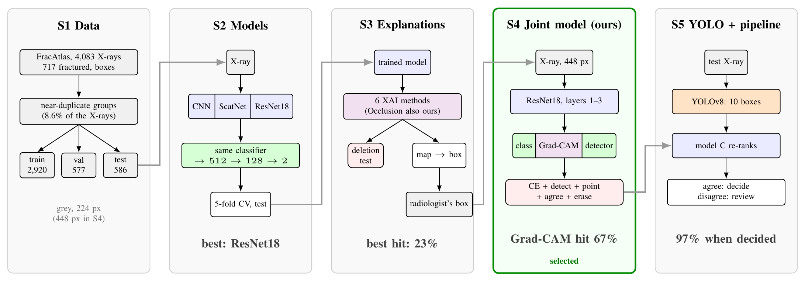
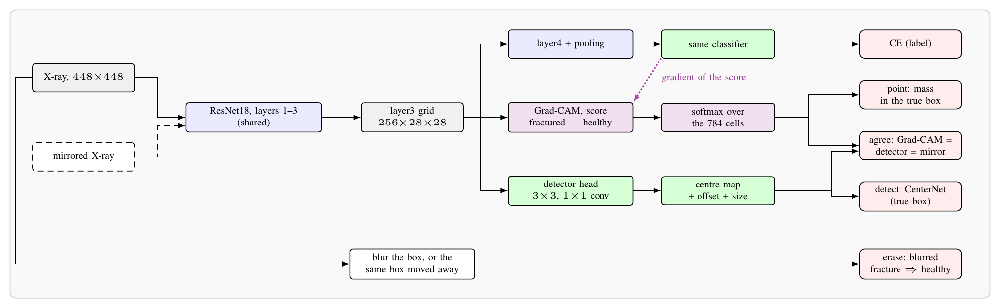

# Teaching a Fracture Classifier Where to Look

**CNN vs ScatNet, six XAI methods and a joint classifier–detector on FracAtlas**

MSc in Artificial Intelligence · Visual Intelligence 2025/2026 · University of Verona

A model can say "fractured" for the wrong reason, for example because it sees a metal plate or a cast instead of
the fracture line. This project asks two questions on the X-rays of
[FracAtlas](https://www.kaggle.com/datasets/mahmudulhasantasin/fracatlas-original-dataset):
**is the model right**, and **does it look at the fracture?** The dataset has the radiologists' fracture boxes, so we
can measure where the model looks.

## The architecture



The project is one pipeline of five stages, read from left to right:

1. **S1 Data.** 4,083 X-rays, 717 of them fractured. Copies of the same X-ray are found and kept together, so the test
   set never contains an X-ray the model has already seen.
2. **S2 Models.** A CNN (learns its filters), a ScatNet (fixed wavelet filters) and a pretrained ResNet18. All three
   end with **the same classifier**, so only the feature extractor changes. ResNet18 wins.
3. **S3 Explanations.** Six XAI methods (Saliency, Integrated Gradients, Guided Backprop, Grad-CAM, Occlusion, LIME;
   Occlusion is also written from scratch). We check if each map is **faithful** and if it **points at the fracture**.
   Even the best one points at it only 23% of the time.
4. **S4 Our method.** One network that **classifies and finds the fracture at the same time**, and is trained to look
   at the right place (picture below).
5. **S5 YOLO + pipeline.** A YOLOv8 detector proposes boxes, our model picks one. The two act as two opinions: if they
   agree, the pipeline decides; if not, a radiologist checks the X-ray.

### Our method: the joint model (S4)



One ResNet18 sees the X-ray at 448 px and builds one shared grid. Three things read that grid: the **classifier**
(fractured or not), a small **detector** (where is the fracture) and **Grad-CAM** (where the classifier looks). Five
losses train everything together:

| Loss | What it asks, in simple words |
|---|---|
| CE | give the right answer |
| detect | put a box on the fracture |
| point | the explanation must point inside the radiologist's box |
| agree | the explanation, the detector and the mirrored X-ray must point at the same place |
| erase | if the fracture is blurred, say "not fractured"; if something else is blurred, keep the answer |

We compare three versions: **A** (only CE), **B** (CE + detect) and **C** (all five, our method).

## Final test results

All models are tested on the same **586 test X-rays (104 fractured)** that were never used for training.
Answering "not fractured" every time already gives 82.3% accuracy, so look at **F1** and **fractures found**.

| Model | Accuracy [95% CI] | F1 | Fractures found | Healthy called healthy | AUC | Explanation on the fracture* |
|---|---|---|---|---|---|---|
| CNN (224 px) | 80.9 [77.8, 84.0] | 23.3 | 16.3 | 94.8 | 68.6 | 4% |
| ScatNet (224 px) | 80.0 [76.8, 83.3] | 31.6 | 26.0 | 91.7 | 72.7 | 4% |
| ResNet18 (224 px) | 91.5 [89.2, 93.7] | 73.7 | 67.3 | 96.7 | 91.2 | 23% |
| A: ResNet18, 448 px | 93.3 [91.3, 95.2] | 81.0 | 79.8 | 96.3 | 94.4 | 54% |
| B: + detector | **94.2** [92.2, 96.1] | **82.3** | 76.0 | **98.1** | 94.3 | 60% |
| **C: + XAI losses (ours)** | 93.0 [90.8, 94.9] | 80.4 | **80.8** | 95.6 | **95.2** | **67%** |

\* best of the six XAI methods: how often its hottest point lies inside the radiologist's box (a random point: 1%).

| Detector and pipeline | Result |
|---|---|
| YOLOv8: best box on the fracture | 79% (mAP@0.5 54.4%; the FracAtlas paper reports 56.2%) |
| YOLO + our model C: AP@0.5 on all X-rays | 40.7% → 46.9% (fewer false boxes on healthy X-rays) |
| Final pipeline | decides 76% of the X-rays, right 96.6% of the time, misses 5.8% of the fractures |

**What the results mean, in short:**

- **CNN and ScatNet** do not really learn fractures: they find only 16–26% of them and are statistically tied
  (McNemar p = 0.55). The pretrained **ResNet18** is much better.
- **Our model C** is as accurate as the others, but it **looks at the fracture**: Grad-CAM points at it 67% of the
  time instead of 35% (p < 0.001). If the fracture is blurred, its confidence drops from 84% to 3%, so the decision
  really comes from the fracture.
- **YOLO** is still the best at drawing the box. Our model helps it by removing the boxes it draws on healthy X-rays.

All numbers are in `results/summary.json` and all plots in `results/figures/`.

## How to run the code

The training needs a GPU, so it runs on **Kaggle** (free GPU). The whole notebook takes about **6 hours** on a T4 GPU.

### Option 1: on the Kaggle website (nothing to install)

1. Log in to [kaggle.com](https://www.kaggle.com) with a **phone-verified** account (needed for the GPU and the
   internet).
2. Click **Create → New Notebook**, then **File → Import Notebook** and upload
   `notebooks/bone-fracture-detection.ipynb`. Its first cell already contains the project's code.
3. In the right panel: **Add Input** → search `fracatlas-original-dataset` (by *mahmudulhasantasin*) → **Add**.
4. In **Settings**: Accelerator = **GPU T4**, Internet = **On**.
5. To test quickly first (about 10 minutes), set `QUICK = True` in the **Settings** cell. For the real run, set it
   back to `False`.
6. Click **Run All**. When it finishes, the **Output** tab has `results/summary.json` and `results/figures/`.

### Option 2: from your terminal with `run.sh`

`run.sh` is a bash script: it works on macOS and Linux, and on Windows in **Git Bash** (installed with Git for
Windows). It uploads the code to Kaggle, starts the notebook and downloads the results.

**Once, on each computer:**

1. Install **Python 3.9+** and the Kaggle tool: `python -m pip install kaggle`
2. Create a **Kaggle API token**: kaggle.com → Settings → API → *Create New Token*. Put the downloaded `kaggle.json`
   in `~/.kaggle/kaggle.json` (Windows: `C:\Users\<you>\.kaggle\kaggle.json`).
   The notebook runs on this account; check which one with `kaggle config view`.

**Every run:**

```bash
./run.sh push --quick   # 1. quick check, about 10 minutes
./run.sh status         # 2. is it done? (wait for "complete")
./run.sh push           # 3. full run, about 6 hours (you can switch the computer off)
./run.sh get            # 4. download the results into ./results
```

| If you see | Do this |
|---|---|
| *Kaggle login failed* | put a fresh `kaggle.json` in the `.kaggle` folder |
| *Kaggle refused the request* (403) | the account is not phone-verified; if it happens during `get`, run it again |
| *Kaggle username not found* | `./run.sh push --user <your-kaggle-username>` |
| status *error* | `./run.sh get`, then read the `.log` file in `out/run-<time>/` |

### Option 3: on your own computer

```bash
python -m pip install -r requirements.txt
# download FracAtlas from Kaggle and unzip it into data/
jupyter notebook notebooks/bone-fracture-detection.ipynb
```

Without a GPU this is very slow; set `QUICK = True` to try it. To check the code without the dataset:

```bash
pytest -m "not slow"   # unit tests, a few minutes on a CPU (synthetic X-rays)
```

## Paper and presentation

| | File |
|---|---|
| Report (IEEE, 8 pages) | `paper/fracture_paper.tex` and `paper/fracture_paper.pdf` |
| Slides (16:9) | `paper/presentation/fracture_presentation.tex` and `.pdf` |

## Project layout

```
notebooks/bone-fracture-detection.ipynb   the experiment, with the outputs of the last run
src/                                      the code, one module per step:
   data.py · models.py · training.py · xai.py · occlusion_scratch.py · localize.py
   joint.py (our method) · detect.py (YOLO) · pipeline.py · plots.py · report.py
results/                                  summary.json and figures of the last run
paper/                                    report and presentation
docs/                                     architecture pictures, logs of the first version
tests/                                    tests on synthetic X-rays
run.sh                                    Kaggle launcher (scripts/kaggle_run.py)
```

## References

Abedeen et al. 2023 (FracAtlas) · Linda 2025 (fracture detection and reporting) · Bruna & Mallat 2013 (scattering) ·
Simonyan et al. 2014 (saliency) · Springenberg et al. 2015 (guided backprop) · Zeiler & Fergus 2014 (occlusion) ·
Ribeiro et al. 2016 (LIME) · Sundararajan et al. 2017 (integrated gradients) · Selvaraju et al. 2017 (Grad-CAM) ·
Samek et al. 2017 (deletion test) · Zhang et al. 2018 (pointing game) · Li et al. 2018 (GAIN) · Zhou et al. 2019
(CenterNet) · Heo et al. 2019 (fooling interpretations) · Chen et al. 2020 (SimCLR) · Rao et al. 2023 (model
guidance) · Captum · Kymatio · Ultralytics YOLOv8. Full list in the paper.
